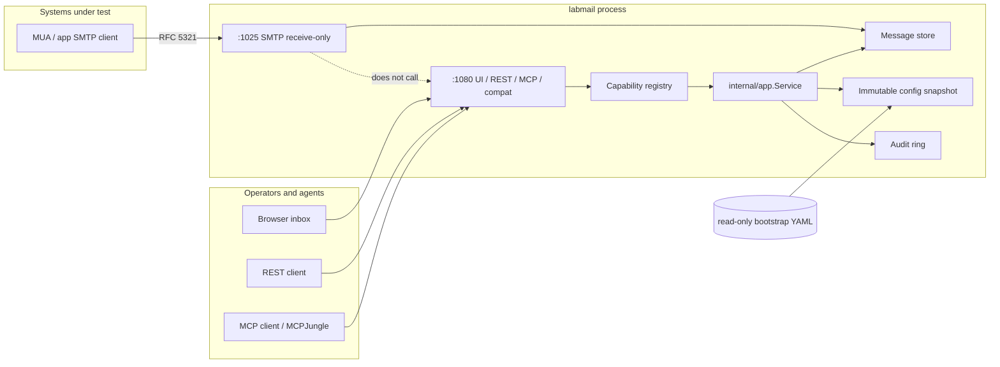

# System Architecture

Status: Proposed normative behavior
Owners: Architecture, SMTP, Control Plane
Last reviewed: 2026-08-17 (FND-001)
Related ADRs: 0001, 0002, 0003, 0004, 0005, 0006, 0007

## Problem statement

`mcp-integration-lab` today sinks mail into the off-the-shelf Node image `maildev/maildev:2.2.1`. That image meets the port and “capture for inspection” contract, but it is not a first-party lab appliance: it has no MCP surface, no versioned YAML desired state, no REST/MCP parity, no capability registry, no audit/revision model, and its only receive-only guarantee is a compose-time flag filter — not a property of the server itself.

**LabMail** is a single-process Go lab appliance in the LabDNS / LabLDAP / TacLab family. Systems under test deliver RFC 5321 SMTP to it. LabMail captures, indexes, and exposes every accepted message over REST, MCP, and an embedded inbox UI. It **never** opens an outbound SMTP session, **never** relays, and **never** implements `POST /email/:id/relay`. Desired state is a fail-closed `labmail.dev/v1alpha1` YAML file. Captured mail is ephemeral: restart or reset returns the process to the mounted bootstrap and an empty inbox.

## Naming and artifacts

| Kind | Value |
|---|---|
| Product | LabMail |
| Repository | `github.com/hilather/go-lab-maildev` |
| Go module | `github.com/hilather/go-lab-maildev` |
| Binary / CLI | `labmail` |
| Image | `ghcr.io/hilather/labmail` (`:local` for compose builds, digest-pin in GitOps) |
| Container user | `65532:65532` |
| Config schema | `labmail.dev/v1alpha1` |
| Kind | `LabMail` |
| Native REST | `/v1` |
| MCP | `POST /mcp` (Streamable HTTP, stateless) |
| Compat REST | `/email`, `/healthz`, `/config` |
| UI | `/` (SPA) |
| Metrics | Hand-rolled OpenMetrics; default `127.0.0.1:9090`; lab overlay may bind `:9090`; `/v1/metrics` only if `publicPath: true` |
| Error URN prefix | `urn:labmail:error:` |
| MCP resource URI | `labmail://...` |
| Default SMTP bind | `:1025` |
| Default management bind | `:1080` |
| Healthcheck | `labmail healthcheck --url=http://127.0.0.1:1080/v1/health/ready` |

## Goals (1.0)

1. Single-process Go appliance that accepts SMTP and never sends mail.
2. Versioned, fail-closed YAML bootstrap; runtime mail ephemeral; reset rereads bootstrap and wipes the inbox.
3. Same authorized mail and state operations on REST and MCP (parity).
4. Drop-in listener contract for mcp-integration-lab: SMTP `:1025`, management `:1080`, `GET /email` + Basic auth still work.
5. Embedded operator inbox UI that calls REST only.
6. Hardened container: non-root UID 65532, scratch/static, read-only root, `cap_drop: ALL`, no-new-privileges, tmpfs `/tmp`.
7. In-tree SMTP receive state machine (RFC 5321 subset) with explicit accept/reject table.
8. Bounded message store (count + bytes) with a fail-closed full policy.
9. Structured errors, audit, metrics, live/ready probes.
10. Design-pack-first repo: normative docs, ADRs, generated contracts, and a task/PR plan before (and with) code.

## Non-goals (1.0)

- Outbound SMTP, relay, smarthost, DSN generation, MX lookup, or any `net.Dial` / `DialTimeout` / `Dialer.Dial` in production `internal/smtp`, `internal/store`, or `internal/app` (clients live only in `internal/smtptest` `*_test.go`).
- Being an MDA, IMAP/POP3 server, mailing-list manager, or spam filter.
- Full RFC 5321/5322/6409/7504/8461/8617 conformance as a public MTA. This is a **lab sink**. Interop target is “common language clients (`net/smtp`, nodemailer, Django, Spring, swaks, curl `--ssl-reqd` off) can deliver.”
- CHUNKING (`BDAT`), PIPELINING advertised, DSN (`ORCPT`/`NOTIFY`), `VRFY`/`EXPN` that imply a mailbox, `ETRN`/`ATRN`/`TURN`.
- Open relay semantics presented as a feature (the sink accepts any RCPT, but that is *capture*, not *relay*).
- SMTP fault-injection / chaos engine (LabDNS-style). Deferred.
- Durable mail-directory persistence, object stores, or databases.
- Multi-replica shared inbox or consensus.
- maildev WebSocket protocol, Angular UI clone, or `/api` v3 paths.
- OAuth Protected Resource Metadata (family exemption: lab static bearer).
- DKIM/SPF/DMARC verification or signing.
- Calendaring, S/MIME verification UI, or virus scanning.
- Wrapping or exec’ing the Node maildev image.
- Implicit SMTPS (TLS-on-accept) in 1.0. Schema field `smtp.tls.mode: implicit` is **rejected at validate**. The 1.0 shim **rejects** maildev `--incoming-secure` / `--incoming-cert` / `--incoming-key` (those are SMTPS, not STARTTLS). 1.1 may add `listeners.smtpImplicit.address` on a distinct bind; it must not share cleartext `:1025`.

## Key decisions

These are closed. Implementers do not re-litigate them without an ADR.

| ID | Decision | Rationale |
|---|---|---|
| **D1** | **Product name is LabMail.** Repo remains `go-lab-maildev`. Module `github.com/hilather/go-lab-maildev`. Binary `labmail`. Image `ghcr.io/hilather/labmail`. YAML `apiVersion: labmail.dev/v1alpha1`, `kind: LabMail`. | Follow **LabDNS** naming (`labdns` / `ghcr.io/hilather/labdns`). TacLab is the frozen exception (ADR 0018, image `ghcr.io/hilather/go-lab-tacacs-mcp`). |
| **D2** | **Single process, two planes.** SMTP data plane is independent of management HTTP. One binary, one container. | LabDNS / TacLab process model. SMTP must keep accepting if REST/MCP is slow or unbound (`--management-listen=off`). |
| **D3** | **Desired state is YAML; inbox is not.** Config revision is a content hash of canonical spec. Message store has its own monotonic `storeGeneration`. Reset reloads YAML **and** wipes mail. | Family GitOps invariant. Captured mail is runtime evidence, not desired state. |
| **D4** | **REST and MCP share one capability registry.** Adapters never call each other and never contain store/SMTP business logic. | LabDNS ADR 0004. Today’s maildev having no MCP is the gap this product closes. |
| **D5** | **Native management API is `/v1` + `POST /mcp`.** Maildev `/email` is a **compat adapter** (`REST_ONLY_PROTOCOL` plus parity-required native twins). | Compat exists only so mcp-integration-lab smoke and any existing `/email` clients survive the swap. |
| **D6** | **Auth: lab static bearer is primary; HTTP Basic is an explicit compat authenticator that maps onto the same principal.** MCP is bearer-only. No OAuth PRM. | Lab swap requires Basic (`MAILDEV_WEB_USER` + `secrets/maildev-web-password`). One verifier, one scope matrix. |
| **D7** | **Receive-only is structural.** No SMTP client in production packages. Config loader rejects reserved outbound keys. Compat `POST /email/{id}/relay` returns 403. | Stronger than the current compose-time flag filter. `Listen`/`Accept` only. |
| **D8** | **In-tree SMTP server** (`internal/smtp/{codec,server}`). Standard library `net` + `crypto/tls` only. No `emersion/go-smtp` in the server. Implicit SMTPS is **1.1**. | Family owns protocol state machines. Receive-only is easier to prove if we own every command. |
| **D9** | **MIME parsing is adapted**, not invented. `internal/mimeparse` is the only package that may import `github.com/emersion/go-message` (and charset helpers). Types never leak. | MIME is too large to write safely in 1.0. |
| **D10** | **Default SMTP posture matches the lab profile:** no AUTH, no TLS required, any MAIL FROM / RCPT TO accepted, SIZE advertised. AUTH and STARTTLS are YAML-optional. | Preserves `labinfo` note and smoke `smtp.SendMail(..., nil, ...)`. |
| **D11** | **Store is memory-first** with **stacked** caps. Stored `resident + candidate ≤ maxBytes`. Independently, `reservedInFlight ≤ maxInFlightDataBytes`. Default `fullPolicy: reject` (SMTP `452`). | Prevents OOM. Two knobs so in-flight DATA does not shrink the inbox budget. |
| **D12** | **Embedded inbox UI ships in 1.0.** React/TS + Vite (Node **22.14.0**), embedded like TacLab/LabLDAP. Calls generated REST only. No Relay button. Frozen table: [Embedded operator UI](#embedded-operator-ui). | Replacement contract includes a web UI on 1080. GA is not done without PR 12. |
| **D13** | **Container ports stay 1025 / 1080.** Management default bind is `:1080`, not LabDNS’s `:8080`. | Compose map `${MAILDEV_WEB_PORT:-1080}:1080` does not change. |
| **D14** | **Go 1.26, official MCP SDK `v1.7.0`, protocol `2026-07-28`, Apache-2.0.** `gopkg.in/yaml.v3` with `KnownFields(true)`. | Family pins (LabDNS/LabLDAP go 1.26). |
| **D15** | **Compat catalog id stays `maildev` during the swap release.** Product name in docs/UI is LabMail. labinfo `name` becomes `Mail sink (LabMail, receive-only)`. | Avoids breaking agent prompts and `services.yaml` id references. A later lab release may rename the id. |
| **D16** | **No chaos engine in 1.0.** | A mail sink’s job is reliable capture. |
| **D17** | **MCP `spec.management.mcp.allowLegacyClients` default false; integration-lab overlay sets true.** `subscriptions/listen` stays pinned to 2026-07-28. | TacLab knob so MCPJungle (`mark3labs/mcp-go v0.48`) can register without a LabMail patch. |

## Process architecture

One `labmail` process. Invalid bootstrap does **not** bind SMTP or management (LabDNS rule).



```text
SMTP wire
  -> admission (conns, rate, size)
  -> session state machine (internal/smtp/server)
  -> on 250 after DATA: parse MIME (internal/mimeparse)
  -> store.Insert
  -> metrics + optional audit "mail.received"

REST adapter ----+
MCP adapter -----+--> capabilities registry --> app.Service
Compat adapter --+                              -> store / snapshot / audit
UI (static) -----> REST only
```

**Invariant:** `internal/smtp` must not import `internal/control` (including `internal/control/mcp` and `internal/control/rest`), `internal/web`, or `internal/control/compat`. Management failure must not stop SMTP. SMTP must not block on MCP clients.

## Embedded operator UI

Required for GA / 1.0 (D12, PR 12). The UI talks REST only. XSS/CSP/`cid:` rewrite: [docs/06-rest-api.md](https://github.com/hilather/go-lab-maildev/blob/main/docs/06-rest-api.md) and [docs/08-security-architecture.md](https://github.com/hilather/go-lab-maildev/blob/main/docs/08-security-architecture.md).

| Item | Choice |
|---|---|
| Stack | React + TypeScript + Vite (Node 22.14.0), TacLab/LabLDAP pattern |
| Embed | `internal/web` `go:embed` of `web/dist` (copy step; `web/` has its own `go.mod` if needed like TacLab) |
| Auth | Login page: paste bearer **or** basic username/password. `POST /v1/session`. Cookie `labmail_session` + `X-LabMail-CSRF`. Cookie is REST-only. |
| Pages | Inbox list, message view (text / HTML preview / headers / raw / attachments), status (revisions, store stats), audit (if scoped), gated reset |
| Live update | `EventSource` `GET /v1/events/stream` (SSE). Fallback: 3s poll of `GET /v1/messages`. **No** maildev WebSocket. |
| HTML preview | `<iframe src="/v1/messages/{id}/preview" sandbox>` — **no** `allow-scripts`, **no** `allow-same-origin`, **no** `allow-popups-to-escape-sandbox`. Not `srcdoc`. Never parent `innerHTML`. |
| Missing on purpose | Relay button, “send”, outgoing settings, compose-new-mail |

`spec.ui.enabled: false` serves 404 for `/` but keeps REST/MCP (`--disable-web` is **not** “disable management”).

## Package layout

```text
.
|-- AGENTS.md
|-- README.md
|-- START-HERE.md
|-- LICENSE
|-- CHANGELOG.md
|-- Makefile
|-- go.mod                         # github.com/hilather/go-lab-maildev
|-- Dockerfile
|-- cmd/labmail/                   # process entrypoint only
|-- internal/
|   |-- model/                     # Spec, Message, Envelope, Operation
|   |-- config/                    # decode, KnownFields, normalize, validate, hash, export
|   |-- compiler/                  # spec → snapshot
|   |-- snapshot/                  # atomic config snapshot
|   |-- store/                     # inbox
|   |-- smtp/
|   |   |-- codec/                 # lines, replies
|   |   `-- server/                # listener + session
|   |-- mimeparse/                 # only importer of emersion/go-message
|   |-- app/                       # Service (no HTTP/MCP types)
|   |-- capabilities/              # registry
|   |-- control/rest/
|   |-- control/mcp/
|   |-- control/compat/
|   |-- auth/
|   |-- audit/
|   |-- domainerr/
|   |-- observability/
|   |-- buildinfo/
|   |-- web/                       # embed SPA
|   `-- smtptest/                  # test client; not linked from cmd except tests
|-- api/
|   |-- jsonschema/labmail.dev.v1alpha1.json
|   |-- openapi/v1.json
|   |-- mcp/v1.json
|   |-- capabilities/v1.json
|   |-- metrics/v1alpha1.json
|   `-- errors/v1.json
|-- web/                           # Vite app
|-- docs/                          # normative pack + adr/
|-- examples/compose.smoke.yaml
|-- testdata/config/{valid,invalid}/
|-- testdata/smtp/                 # session transcripts
|-- testdata/mime/
|-- testdata/compat/               # TestMaildevScenarioCompat + 2.2.1 goldens
|-- scripts/{generate,checkdocs,test-container.sh}
`-- tasks/                         # program board, one file per PR
```

`cmd/labmail` contains no protocol or store logic.

## Control-plane packages

Follow LabDNS:

```
internal/capabilities     declarations (no app import)
internal/app              Service methods
internal/control/rest     HTTP /v1
internal/control/mcp      Streamable HTTP /mcp
internal/control/compat   maildev /email shim → app.Service
internal/auth             bearer + basic → Principal
internal/audit            ring
```

## Allowed third-party direct deps at 1.0

| Module | Why |
|---|---|
| `gopkg.in/yaml.v3` | Family config |
| `github.com/modelcontextprotocol/go-sdk v1.7.0` | Family MCP |
| `github.com/emersion/go-message` | MIME adapter only |
| `github.com/oklog/ulid/v2` | Crockford ULID message ids (MIT) |

No Prometheus client (`github.com/prometheus/*` forbidden, LabDNS `import_test.go` style). Metrics are **hand-rolled OpenMetrics** text in `internal/observability`. No other SMTP/MIME/HTTP frameworks. Prefer `net/http`, `log/slog`, `crypto/tls`. New deps need a PR justification and license check (Apache-2.0 compatible).

## Canonical data model

Canonical Go types in `internal/model` (implemented in CFG-001 / STORE-001):

```go
type Spec struct {
    Listeners     ListenersSpec
    SMTP          SMTPSpec
    Store         StoreSpec
    UI            UISpec
    Management    ManagementSpec
    Observability ObservabilitySpec
}

type Message struct {
    ID            string
    ReceivedAt    time.Time
    Envelope      Envelope
    Headers       []Header // ordered, case-preserving names
    Subject       string
    From, To, Cc, Bcc, ReplyTo []Address
    MessageID     string
    InReplyTo     string
    Date          time.Time
    Text          string
    HTML          string
    Raw           []byte // may be spill-backed; accessor hides that
    Size          int
    Read          bool
    Priority      string
    ParseWarning  string
    Attachments   []Attachment
}

type Envelope struct {
    From          string
    To            []string
    HELO          string
    RemoteAddr    string // logged/metric-labeled only as class, not raw IP in metrics
    TLS           bool
    AuthUser      string // empty if none; never the password
}
```

## CLI

```text
labmail serve --config=/etc/labmail/config.yaml
              [--smtp-listen ADDR] [--management-listen ADDR|off]
              [--shutdown-timeout 5s] [--pid-file /tmp/labmail.pid]
labmail validate --config=...
labmail canonicalize --config=... [--format yaml|json]
labmail healthcheck --url=http://127.0.0.1:1080/v1/health/ready
labmail version
```

`serve` loads → compile → bind SMTP → bind management → write pid file. `SIGTERM`/`SIGINT`: stop SMTP accept, drain sessions (deadline), then HTTP, then `store.Wipe` spill files. `SIGUSR1` unused (no chaos).

Optional later: `labmail send` is **not** shipped in the production binary (it would look like a sender). Tests use `internal/smtptest`.

FND-001 implements `version` and `help` only.

## Invariants

1. SMTP request handling does not depend on REST or MCP availability.
2. Invalid bootstrap does not bind SMTP or management.
3. REST and MCP call the same application capabilities.
4. Bootstrap YAML is read-only to the service.
5. Unknown configuration fields are errors.
6. Outbound SMTP is unrepresentable.
7. Runtime inbox is ephemeral and does not set `drifted`.
8. `internal/smtp` does not import management packages.

## Residual limitations (1.0)

- Not a complete MTA. No DSN, CHUNKING, PIPELINING, Sieve, quotas per recipient, or greylisting.
- MIME parse of pathological messages may yield empty text/html with `parseWarning`; raw is still stored.
- Default `maxMessageBytes` is **10 MiB** (maildev implicit ~50 MiB; 2.2.1 has no `--max-message-size` flag).
- No maildev `--incoming-secure` equivalent in 1.0 (implicit SMTPS is 1.1; shim rejects those flags instead of mapping to STARTTLS).
- `ui.enabled: false` hides the SPA only; REST/MCP stay up (not maildev `--disable-web`).
- `mail-directory` and `base-pathname` are rejected (no passthrough).
- Compat `/email` ids are ULIDs; list omits `text`/`html`; checksum is sha256 not md5; `GET /config` is a redacted LabMail shape.
- Compat does not implement maildev WebSocket.
- `POST /email/:id/relay` never works (intentional).
- SMTP AUTH is PLAIN/LOGIN only. Implicit SMTPS is 1.1.
- Healthcheck plane in compose changes from SMTP TCP (`node`) to HTTP `/v1/health/ready` (ready still requires SMTP bound).
- Worst-case RSS ≈ stored `maxBytes` (256 MiB) + `maxInFlightDataBytes` (64 MiB) + ~64 MiB slack ≈ **384 MiB**. Caps are stacked: in-flight does not reduce inbox capacity. Spill on tmpfs does not add a second disk budget — it is still RAM.
- Single replica; no shared inbox.
- MCP clients requiring OAuth PRM cannot authorize. MCPJungle needs `allowLegacyClients: true` (D17).
- HTML preview blocks remote `https:` images (no tracking pixels).
- No SMTP chaos / fault injection.
- Catalog service id remains `maildev` during the swap release.

## Related documents

- SMTP command table: [docs/02-smtp-semantics.md](https://github.com/hilather/go-lab-maildev/blob/main/docs/02-smtp-semantics.md)
- Store: [docs/03-message-store.md](https://github.com/hilather/go-lab-maildev/blob/main/docs/03-message-store.md)
- YAML: [docs/04-state-and-configuration.md](https://github.com/hilather/go-lab-maildev/blob/main/docs/04-state-and-configuration.md)
- Capability table: [docs/05-control-plane-and-parity.md](https://github.com/hilather/go-lab-maildev/blob/main/docs/05-control-plane-and-parity.md)
- Preview CSP / iframe sandbox: [docs/06-rest-api.md](https://github.com/hilather/go-lab-maildev/blob/main/docs/06-rest-api.md), [docs/08-security-architecture.md](https://github.com/hilather/go-lab-maildev/blob/main/docs/08-security-architecture.md)
